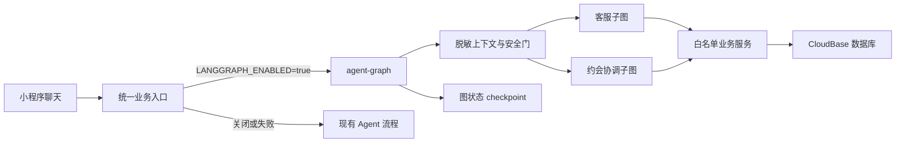

# WeFinally LangGraph 客服与约会协调设计

日期：2026-08-11
分支：`feature/langgraph-orchestration`

## 1. 目标

将现有 AI 客服与双方约会协调改造成可持久化、可暂停、可恢复、可人工接管的 LangGraph 状态图，同时保持现有小程序接口、匹配算法、AI 匹配报告、会员和支付流程兼容。

首期不改造匹配排序与匹配报告。模型不直接访问数据库，不依赖供应商 `conversation_id`，不接触手机号、OpenID、密钥、私钥、精确地址或另一方原始消息。

## 2. GitHub 参考实现

### 2.1 采用的官方模式

- [langchain-ai/langgraphjs](https://github.com/langchain-ai/langgraphjs)：使用 `StateGraph`、条件边、checkpoint、`interrupt()` 与 `Command(resume)`。
- [官方客服状态机示例](https://github.com/langchain-ai/langgraphjs/blob/main/examples/chatbots/customer_support_small_model.ipynb)：借鉴“前台分流 → 专项节点 → 条件路由 → 敏感操作暂停”的结构。
- [langchain-ai/agent-inbox-langgraphjs-example](https://github.com/langchain-ai/agent-inbox-langgraphjs-example)：借鉴接受、编辑、忽略、补充回复四类人工确认结果。该项目采用 MIT License。
- [LangGraph.js Human-in-the-loop](https://github.com/langchain-ai/langgraphjs/blob/main/docs/docs/agents/human-in-the-loop.md)：借鉴持久化 checkpoint、内部 `thread_id` 和恢复执行方式。

### 2.2 只参考业务分层的社区项目

- [CeloAraujo/medical-appointment](https://github.com/CeloAraujo/medical-appointment)：其“识别意图 → 安排/取消 → 回复”节点划分可作为业务参考。

该社区项目无明确许可证，并且服务直接修改内存预约数组。WeFinally 不复制其代码，也不采用模型或图节点直接写业务数据的方式。

## 3. 技术方案

新增独立的 TypeScript `agent-graph` 云函数，使用 Node.js 18 运行时和 `@langchain/langgraph`。现有 Node.js 16 `api` 云函数继续承担原有业务，避免原地升级造成中断。

小程序仍调用统一请求层。Agent 请求在功能开关开启时进入 `agent-graph`；关闭或图执行失败时，回退到当前确定性 Agent 流程。



模型只能收到脱敏上下文并输出结构化决策。数据库适配器不会注入模型节点；只有经过 schema 校验、权限校验和幂等校验的业务工具能够读写数据。

## 4. 状态模型

图状态只保存运行所需的最小信息：

- `threadId`：WeFinally 生成的内部随机 ID，不是 DeepSeek 会话 ID。
- `actorRef`：不可逆或内部映射后的用户引用，不向模型暴露 OpenID。
- `mode`：`customer_service` 或 `date_coordination`。
- `phase`：当前节点和等待状态。
- `riskLevel`：安全分类结果。
- `safeSummary`：限长、脱敏的历史摘要。
- `coordinationId`：双方协调业务引用，仅在工具层解析。
- `coordinationVersion`：防止旧确认覆盖新需求。
- `partyAState`、`partyBState`：相互隔离的结构化偏好，不保存对方原始表达。
- `pendingAction`：等待用户或人工确认的候选动作。
- `lastResult`：白名单工具返回的安全 DTO。

checkpoint 使用独立集合或适配器保存，并设置保留期限。它不重复保存聊天全文；聊天内容继续遵守现有留存与审计策略。

## 5. 客服子图

```text
安全检查
  → 意图分类
  → 普通咨询 / 投诉与风险 / 约会协调
  → 生成回复或创建人工工单
  → 敏感动作 interrupt
  → 管理员接受、编辑、拒绝或补充
  → 恢复执行并记录审计事件
```

投诉、隐私请求、支付争议、人身安全、高风险内容进入人工处理。模型可以建议回复和工单分类，但不能自行关闭投诉、退款、封禁用户或修改会员状态。

## 6. 双方约会协调子图

```text
读取发起方安全状态
  → 解析 A 的结构化偏好
  → 通知并等待 B
  → 解析 B 的结构化偏好
  → 确定性计算双方交集
  → 无交集：生成下一轮询问
  → 有交集：生成候选方案
  → 分别等待 A、B 确认
  → 版本一致：提交白名单业务服务
  → 版本变化：废弃旧候选并重新计算
  → 完成或转人工
```

时间、区域、场所类型和预算交集由确定性代码计算，模型只负责把自然语言转换成受限字段及生成友好说明。任一方修改需求后，`coordinationVersion` 增加，旧 proposal 和旧确认立即失效。

另一方只能看到系统生成的可共享摘要，不能看到请求方的原始消息、修改理由或完整表单。

## 7. 白名单工具

首期只允许以下工具：

- 查询本人客服会话安全状态。
- 创建或补充人工工单。
- 查询本人匹配和协调摘要。
- 创建约会申请修改预览。
- 确认本人拥有且版本一致的修改预览。
- 发送系统生成的对方通知。
- 查询双方结构化偏好的确定性交集。

每个工具必须具备输入 schema、所有权检查、版本检查、幂等键和安全 DTO 输出。模型生成的工具名或参数不在白名单时直接拒绝并记录审计事件。

## 8. 兼容与回退

- `LANGGRAPH_ENABLED=false`：所有请求走现有流程。
- `LANGGRAPH_SHADOW_MODE=true`：图只运行并记录脱敏决策，不执行工具，用于内测比较。
- 图超时、checkpoint 损坏或模型不可用：返回当前确定性降级回复，不重复执行工具。
- 每次工具调用使用 `threadId + coordinationVersion + action` 生成幂等键。
- 不修改匹配、AI 报告、支付和会员接口。

## 9. 测试策略

先写失败测试，再实现：

1. 客服普通问答、投诉转人工、支付争议、安全风险和提示词注入。
2. A/B 首次达成交集、B 修改时间、A 再修改地点、双方同时修改和无交集。
3. 旧 proposal 确认失败、重复确认幂等、恢复执行、checkpoint 过期与模型超时。
4. 模型请求非白名单工具、越权协调 ID、原始消息泄漏和敏感字段泄漏。
5. 开关关闭、shadow mode 和旧流程回退。
6. 现有六组 selfcheck 全量回归。

## 10. 验收标准

- 当一方修改约会需求时，系统应使旧候选和旧确认失效并重新计算双方交集。
- 当流程等待另一方或人工确认时，系统应持久化状态并可在后续请求中恢复。
- 当模型请求写操作时，系统应只允许经过白名单、所有权、版本和幂等校验的业务工具执行。
- 当模型或 LangGraph 不可用时，系统应回退到现有流程且不得重复写入。
- 在任何模型输入、客户端响应或跨用户通知中，系统不得暴露敏感标识和另一方原始内容。
- 现有匹配、报告、支付、会员和后台流程应保持兼容。

## 11. 非目标

- 首期不接入 RAG、向量数据库或自动学习提示词。
- 首期不让 Agent 自动退款、封禁、改会员或直接安排线下见面。
- 首期不替换匹配排序、AI 匹配报告或支付系统。
- 首期不依赖 LangSmith 云服务才能运行。
