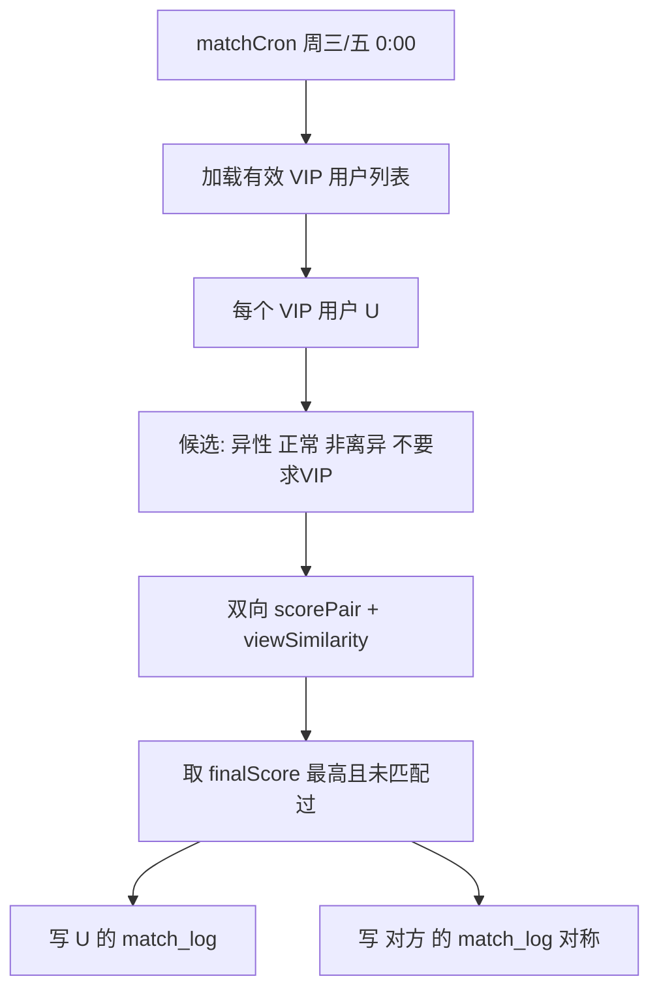

# AI 匹配技术设计

> 最后更新：2026-06-29  
> v1 决策：规则+权重为主；AI 生成理由为辅（**默认关闭**）

---

## 一、三条技术路线对比

### 路线 A：规则 + 权重匹配

**做法**：基于用户资料、择偶配置、三观文本等字段计算加权分，cron 定时为 VIP 用户选最优候选。

| 优点 | 缺点 |
|------|------|
| 可控、可解释、便宜 | 不够「智能」 |
| 适合 MVP、易过审 | 需人工调权重 |
| 与现有代码一致 | 难处理隐含偏好 |

**现状**：`matchService.js` + `viewSimilarity.js` 已是路线 A。

### 路线 B：API / 大模型 / Agent

**做法**：LLM 根据资料生成匹配理由、排序建议、破冰话题。

| 优点 | 缺点 |
|------|------|
| 体验自然 | 成本高、延迟 |
| 理由可读 | 稳定性、幻觉 |
| | 隐私与合规 |

**v1**：`matchConfig.aiGenerateReason = false`，不实现。

### 路线 C：概率模型 / 推荐系统

**做法**：用点击、喜欢、见面确认、反馈等训练排序模型。

| 优点 | 缺点 |
|------|------|
| 长期效果更好 | MVP 数据不足 |
| 个性化 | 冷启动难 |

**v1**：不实现。留存日志为 v3 做准备。

---

## 二、推荐方案（已采纳）

```
第一版 = 路线 A（增强）
       + 路线 B（仅开关预留，默认关）
       + 路线 C（仅日志积累）
```

---

## 三、现有实现架构

```
matchCron.js (周三/五 0:00)
    → matchService.runBatchMatch()
        → 遍历 active VIP 用户（有 match_setting）
        → 筛选候选（异性、正常、非离异）
        → scorePair() 加权
        → viewSimilarity.computeViewSimilarity() 三观分
        → 取最高分 1 人
        → INSERT user_match_log（当前仅单向）
```

### 当前权重（写死在 `matchService.js`）

| 维度 | 满分 | 说明 |
|------|------|------|
| baby_plan | 30 | 完全一致 30，否则 10 |
| view_similarity | 25 | 0-100 映射 |
| age | 15 | 区间内 15，否则递减 |
| height | 12 | 同上 |
| education | 8 | 满足最低学历 8 |
| circle | 6 | 偏好圈层命中 |
| city | 4 | 同城 4 |

**迁移**：抽到 `server/src/config/matchConfig.js`。

### 三观相似度（`viewSimilarity.js`）

- 字符 unigram + bigram Jaccard
- 双向：A.self vs B.target，B.self vs A.target，取平均
- 输出 0-100 整数
- **v1 已确认够用**；v2 可换 embedding（需评估中文婚恋语料）

---

## 四、已确认的逻辑变更（相对现有代码）

### 4.1 被匹配对象不要求 VIP

**现况**：候选 SQL 要求 `is_vip=1`。

**目标**：

- **发起方**（收到空投）：仍须有效 VIP（PRD）
- **候选方**：正常状态用户即可，**不要求 VIP**

**产品影响**：

- 非 VIP 用户可出现在他人匹配池中
- 非 VIP 被匹配到后，对称记录中需设计展示策略（见 QUESTIONS Q1）

### 4.2 双向互配（必须）

包含两层：

#### （1）双向契合 scoring

配对前同时校验：

- A 的择偶条件对 B 的满足度
- B 的择偶条件对 A 的满足度

实现建议：

```javascript
const scoreAB = scorePair(A, settingsA, B, viewSim);
const scoreBA = scorePair(B, settingsB, A, viewSim);
const finalScore = (scoreAB + scoreBA) / 2; // 或 min，待调参
```

`viewSimilarity` 本身已是双向文本交叉，保持不变。

#### （2）对称记录

当 A 在本批次匹配到 B：

- `INSERT (user_id=A, match_user_id=B, ...)`
- `INSERT (user_id=B, match_user_id=A, ...)` 同分同批次

约束：

- 每用户每批次仍最多 1 条「主动空投」记录（VIP 侧）
- B 侧为「被匹配到」记录，类型可标 `match_role: 'airdrop' | 'matched'`

#### （3）去重

同一批次 A↔B 只成一对；避免重复插入。

---

## 五、匹配流程（目标态）



---

## 六、与路线 B 的接口预留

`matchConfig.js` 预留：

```javascript
aiGenerateReason: false,
llmModel: '',
llmPromptTemplate: '',
```

若开启：在 `match-detail` 或列表增加「匹配理由」文案区，**不展示原始 prompt**。

---

## 七、数据表

现有 `user_match_log`：

| 字段 | 用途 |
|------|------|
| user_id | 所属用户 |
| match_user_id | 对方 |
| view_similarity | 三观契合度 0-100 |
| match_date | 批次日期 |
| match_type | 周三/周五 |

**规划新增**（可选）：

- `match_score` INT — 总分
- `match_role` VARCHAR — airdrop / matched

---

## 八、测试要点（匹配专项）

- [ ] VIP 用户仅在有候选时获得 1 条记录
- [ ] 非 VIP 用户可被选为候选
- [ ] 双向记录成对出现
- [ ] 双向择偶不满足时不应配对
- [ ] 同批次不重复配对
- [ ] 离异/封禁用户不在池中
- [ ] view_similarity 与详情页展示一致

---

## 九、实施顺序

1. `matchConfig.js` 抽出权重（R2，行为不变）
2. 双向互配 + 候选放开（P1 专项）
3. 非 VIP 被匹配展示策略（产品确认后）
4. 外貌描述纳入权重（开关默认 false）
5. LLM 理由（远期）

详见 `MODULES/05-AI匹配模块.md` 与 `TODO.md`。
