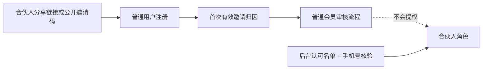
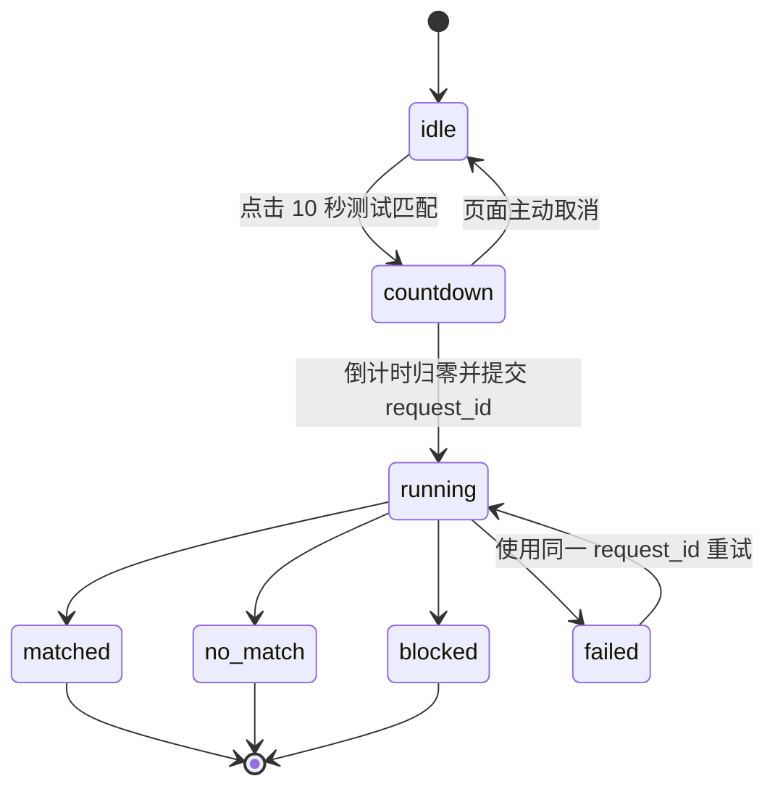

# 邀请、定时匹配与测试画像治理设计

## 1. 现状结论

1. 合伙人工作台已经同时提供微信原生分享和复制 `promote_code`；现有归因策略是首次有效绑定且可多人使用。
2. 注册接口已经把邀请码解析为启用中的合伙人，并写邀请归因；邀请码不应承担合伙人提权。
3. 小程序首页已有开发测试匹配入口，但它立即调用匹配、依赖全局开关，状态只通过 Toast/Modal 表达。
4. 本地 Node 服务存在 `server/src/cron/matchCron.js`，按 Asia/Shanghai 周三、周五 00:00 运行；仓库中 CloudBase 定时配置只发现 `report-worker`，未发现正式 `match-worker`。因此必须先验证云端实际触发器，再补 CloudBase 调度，不能假设本地 cron 会在 CloudBase 运行。
5. 现有 `is_test_fixture`、`fixture_owner_user_id`、`fixture_expires_at`、`allow_date_coordination` 和后台 `is_test` 投影已经提供基础，但“真人 QA 账号”和“合成画像”仍需语义拆分。

## 2. 架构原则

- 权限与测试隔离由确定性后端代码执行，不能只隐藏按钮。
- 公开邀请码只做归因，不做角色授权。
- 正式批次、测试运行、AI 报告和延迟测试响应使用不同记录与幂等键。
- 所有时间判断统一经过 Asia/Shanghai 业务时钟模块；数据库保存 UTC 时间及显式 business date。
- 匹配成功、无候选、被拦截和失败都是一等结果，必须持久化并展示。
- 合成画像只进入所属内部测试账号的隔离候选池。
- AI 只生成受约束文案或排序建议，不能判断用户是否为测试对象、不能决定权限、不能直接落库。

## 3. 邀请与合伙人边界



### 3.1 公开邀请码

- `partner.promote_code` 保持可重复使用和唯一索引。
- `partner_referral_attribution` 以被邀请用户为幂等边界；首次有效归因不可覆盖。
- 分享链接优先使用签名 attribution token，公开邀请码作为人工输入兜底。
- UI 文案改为“复制公开邀请码（可多人使用）”；注册页辅助文案写明“用于确认邀请来源，不会自动成为合伙人”。

### 3.2 合伙人激活

- 继续使用后台 roster candidate + 手机号 HMAC 核验 + 当前微信身份绑定。
- 不接受 `promote_code` 作为 partner activation credential。
- 若未来需要邀请新合伙人，另建 `partner_activation_grant`，必须 phone-bound、single-use、expires-at、revocable；本轮不实现。

### 3.3 姓名展示

- 页面展示优先读取当前已绑定 partner/candidate 的已核验姓名。
- 缺失时显示“合伙人”，不使用 Grace。
- fixture 中允许使用虚构姓名，但必须保持测试标记，不作为生产默认值。

## 4. 正式匹配调度

### 4.1 新增 CloudBase `match-worker`

职责：接收 timer 事件，计算 Asia/Shanghai 业务日期与星期，尝试创建唯一批次，调用共享匹配服务，记录最终状态。

实施前必须通过 CloudBase 官方文档确认 timer cron 字段与时区。不要直接复制 Node cron 表达式。推荐 worker 即使被重复触发也依赖业务日期门禁和数据库唯一批次保证幂等。

### 4.2 批次记录 `match_batch_runs`

建议字段：

```text
_id / id
batch_key                 # formal:YYYY-MM-DD
mode                      # formal | internal_test
business_date
match_type                # 周三 | 周五 | 内部测试
status                    # queued | running | completed_matched | completed_no_match | blocked | failed
request_id
trigger_source            # timer | internal_test_button
requester_user_id         # 测试模式才有
started_at
completed_at
users_considered
candidates_evaluated
matched_count
reason_code
error_class
retry_count
algorithm_version
create_time / update_time
```

约束：

- `batch_key` 唯一；正式批次为 `formal:<business-date>`。
- 错误字段只存分类和脱敏摘要。
- `completed_no_match` 是成功完成状态，不自动重试。
- `failed` 只有瞬态错误可有限重试；最多 1 次，仍失败交人工排查。

### 4.3 服务复用

- 从 HTTP handler 中抽取共享 `matchingRunService`，供正式 worker 和测试 route 调用。
- 正式模式使用现有 claim/delivery 原子约束。
- 测试模式只处理 requester 与归属 fixture，写测试运行/测试匹配记录，不写正式 claim。
- worker 和 route 不复制评分、硬筛、语义重排逻辑。

## 5. 10 秒内部测试体验

### 5.1 UI 设计规格

```text
DESIGN SPECIFICATION
1. Purpose Statement: 在现有首页为内部测试人员提供可验证的匹配状态机，不改变正式用户的产品体验。入口只服务 QA，必须清楚展示倒计时和最终结果。
2. Aesthetic Direction: Luxury/refined，延续现有 WeFinally 温暖克制的品牌视觉。
3. Color Palette: 复用项目现有品牌 token；新增状态仅使用墨色、暖金、成功绿、警示琥珀和错误红，不引入紫色系。
4. Typography: 完全复用小程序既有字体 token；不得为了测试组件引入新字体依赖。
5. Layout Strategy: 复用首页 match-stage 内部的横向测试条，在现有信息层级中嵌入状态轨道；不新增独立页面、不使用覆盖主流程的居中弹窗作为唯一反馈。
```

这里对通用 UI skill 的字体/布局默认禁令做窄范围品牌覆盖：项目已有正式设计系统，本轮必须复用，不能为一个测试入口重做全站视觉。

### 5.2 状态机



- 倒计时只是 UI 模拟等待，不篡改业务时间。
- 点击时先向后端创建/恢复 test run；客户端本地倒计时结束后调用 execute，避免重复点击。
- 推荐 API：
  - `POST /api/match/test-runs`：创建或恢复运行，返回 `run_id`、`execute_after`。
  - `POST /api/match/test-runs/:id/execute`：幂等执行。
  - `GET /api/match/test-runs/:id`：恢复状态。
- 后端必须同时检查：当前用户 `account_mode=internal_qa`、fixture owner、fixture 未过期、正式环境测试总开关。
- 全局 `cloud_demo_match_enabled=true` 不能单独构成授权。

## 6. 测试身份与数据模型

### 6.1 用户字段

在兼容现有字段的前提下增加规范字段：

```text
profile_origin             # real_user | synthetic_fixture
account_mode               # production | internal_qa
test_scope                 # none | matching
fixture_owner_user_id      # synthetic_fixture 必填
fixture_run_id             # 生成批次
fixture_expires_at
allow_date_coordination    # synthetic_fixture 固定 false
```

兼容策略：

- `is_test_fixture=1` 映射为 `profile_origin=synthetic_fixture`。
- `ab_test_owner_user_id` 迁移为/兼容 `fixture_owner_user_id`。
- 不把真人内部测试账号标记成 synthetic；其 `profile_origin=real_user`、`account_mode=internal_qa`。
- 新代码读取规范字段，兼容旧字段；写入只写规范字段并在必要时保留旧标志，待后续迁移完成再删除旧字段。

### 6.2 后台投影

- 身份徽标：真人用户、内部测试账号、合成测试画像。
- 默认列表排除 synthetic fixture；只有明确 `include_tests=true` 且具备管理员权限才返回。
- 详情展示 fixture owner 的安全编号，不暴露 OpenID。
- 测试画像禁止会员运营动作、支付、佣金、客服合并为真人会话或正式约会操作。

### 6.3 补标流程

1. 本地脚本/策略生成 dry-run：待补标数量、ID、推断依据、冲突。
2. 人工审查，禁止仅凭姓名或自由文本猜测 synthetic。
3. 用户确认具体 ID 后，使用 CloudBase MCP 分批更新。
4. 每批回读核验，写审计记录。
5. Cursor 不得直接操作生产数据库。

## 7. 合成画像延迟拒绝

### 7.1 触发边界

只有同时满足以下条件才创建测试响应任务：

```text
actor.profile_origin == real_user
actor.account_mode == internal_qa
target.profile_origin == synthetic_fixture
target.fixture_owner_user_id == actor.id
target.allow_date_coordination == false
fixture 未过期
```

任何真人对真人流程不进入该分支。

### 7.2 `fixture_response_jobs`

```text
interaction_id             # 唯一幂等键
actor_user_id
fixture_user_id
fixture_run_id
response_type              # polite_decline
status                     # scheduled | processing | delivered | failed | cancelled
scheduled_at
delivered_at
delay_hours
message_template_version
error_class
create_time / update_time
```

延迟算法：对 `interaction_id + fixture_run_id` 做 HMAC/稳定哈希，映射到 2—6 小时范围；不能调用模型随机决定。相同 interaction 重试必须得到相同 `scheduled_at`。

### 7.3 Worker

- 可复用独立轻量 timer worker，每分钟/数分钟领取到期任务。
- 使用 lease/compare-and-set 防止重复投递。
- 投递的是明确 `source_type=fixture_simulation` 的测试事件。
- 不触发真实短信、微信订阅消息、人工客服或线下协调。
- 文案由版本化模板生成；如调用模型润色，模型只能看到脱敏场景且输出经过固定 schema 校验。

## 8. 安全与隐私

- 公开邀请码不可交换成 partner token 或 partner role。
- 测试 route 要同时做 UI flag、用户角色、fixture owner 和环境开关校验。
- 测试画像不得包含真实手机号、OpenID、微信号、精确地址或抓取数据。
- 日志只记录安全编号、run ID、原因码和聚合统计。
- 所有 NoSQL 全局写入走云函数业务服务；客户端不能直接改测试标志或 job 状态。
- CloudBase 管理、部署和生产数据核验只允许 MCP；需要控制台/Computer Use 时立即停止。

## 9. 测试策略

### 9.1 单元/策略测试

- 邀请码多人使用、首次归因不可覆盖、公开码不提权。
- business clock 的周三/周五、跨 UTC 日期、夏令时无关性。
- batch key 幂等、重复 timer、失败重试、无候选完成态。
- `profile_origin/account_mode` 组合和 legacy 字段兼容。
- 正式用户不可见 fixture；QA 只能看到自己的 fixture。
- 测试运行不创建正式 claim。
- 延迟映射范围、确定性、重复 interaction 幂等。
- 真人对真人绝不创建自动拒绝任务。

### 9.2 UI 测试

- 非 QA 不渲染测试入口。
- 10 秒倒计时、重复点击、离开/回来、网络失败、重试。
- matched/no_match/blocked/failed 均有持久可读状态。
- 邀请文案明确可多人使用且不自动成为合伙人。
- 姓名缺失时不显示 Grace。

### 9.3 集成/并发测试

- 同一正式 batch 被并发触发只运行一次。
- 同一 test run execute 并发调用只生成一个结果。
- 同一 fixture interaction 并发提交只创建一个 response job。
- fixture 过期或 owner 不匹配时后端拒绝。

## 10. 发布与回滚

- 本地实现先行，每批 TDD、diff review、独立 commit。
- 部署顺序：兼容读取代码 → 新集合/索引 → worker → 后台/UI → 受控测试开关。
- 发布前不开启普通用户可见入口。
- 回滚通过关闭 worker/测试 feature flag，不删除历史批次或 job。
- 生产部署、数据补标、小程序上传必须分别获得用户授权。
