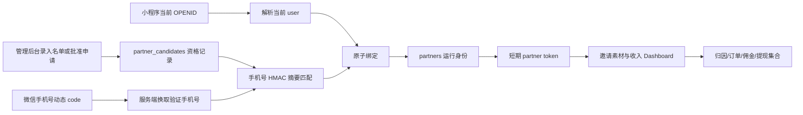
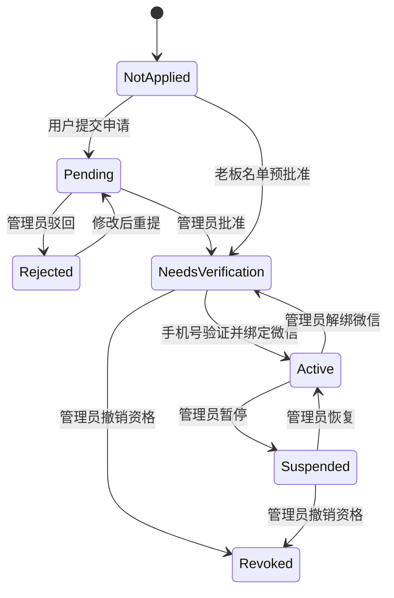

# 合伙人名单制免密激活与审核技术设计

## 1. 设计摘要

本方案在现有 CloudBase `api` Event Function、CloudBase NoSQL、静态管理后台和原生微信小程序之上增量实现。老板名单或后台审批只授予“可激活资格”；首次激活由微信手机号授权证明手机号持有权，并把当前 `OPENID → user_id → partner_id` 原子绑定。后续使用微信身份免密码换取短期合伙人会话，复用现有邀请素材和 Dashboard 服务。

不会把手工输入的手机号当作认证凭证，也不会把普通用户邀请码当作合伙人权限凭证。

## 2. UI 设计规范

### DESIGN SPECIFICATION

1. **Purpose Statement**：让被平台认可的合伙人从“我的”页面自然发现资格、完成一次验证并进入工作台；让管理员用一个可审计工作区完成名单、申请、绑定和停用管理。收入数据需要可信、克制、易核对，不能把后台权限感做成普通营销页。
2. **Aesthetic Direction**：Soft/pastel，叠加 refined financial clarity。沿用 WeFinally 暖粉品牌，但收入区使用深色数字与低饱和绿色，避免娱乐化。
3. **Color Palette**：品牌珊瑚红 `#FF4F78`、暖纸白 `#FFF9F7`、墨色 `#242126`、鼠尾草绿 `#2F7D62`、砂金 `#C89B52`。禁用紫色、靛青和蓝紫渐变。
4. **Typography**：小程序正文使用 `PingFang SC`，金额与编号使用 `DIN Alternate`；管理后台使用 `IBM Plex Sans SC`，数字使用 `IBM Plex Mono`。不引入 Inter、Roboto、Arial、Helvetica 或 system-ui。
5. **Layout Strategy**：小程序采用偏置身份带与 7:5 不等宽指标块，状态标签轻微跨叠在身份带边缘；分享操作沿对角节奏下沉到收入摘要之后。管理后台采用左侧筛选轨、中央审核队列、右侧抽屉式详情的三段结构，不使用居中表单堆叠。

### 2.1 品牌与平台约束

- 现有小程序的暖粉品牌色属于既有产品约束，继续使用但控制饱和面积。
- 新页面不使用 Emoji 图标；采用同一套 Lucide 风格本地 SVG 线性图标，避免远程依赖。
- 所有关键状态同时使用文字、形状和颜色，不能只依赖颜色。
- 金额默认显示两位小数；邀请码、编号使用等宽数字并允许复制。

### 2.2 小程序信息架构

最多新增或重构三个用户界面：

1. **“我的”合伙人计划模块**
   - 始终存在于资料就绪度之后、普通菜单之前。
   - 展示状态标题、简短说明和唯一主操作。
   - `active` 状态直接显示 `WF-P-xxxx` 和“进入工作台”。
2. **合伙人激活/申请页**
   - 一个页面承载 `not_applied / pending / needs_verification / rejected / suspended` 多状态。
   - `needs_verification` 状态先输入名单手机号，再点击 `open-type="getPhoneNumber"` 的“微信验证手机号”按钮。
   - 用户拒绝授权时保留页面状态，不提交激活；提供联系平台的次要入口。
3. **合伙人工作台**
   - 顶部身份带：姓名、`WF-P-xxxx`、公开邀请码。
   - 第一屏：可提现余额、累计佣金、待结算佣金。
   - 第二层：邀请注册、资料完成、已审核、VIP 转化。
   - 第三层：一键分享、小程序码、复制邀请码。
   - 底部：最近佣金流水、会员审核入口、结算规则说明。

### 2.3 管理后台信息架构

现有“合伙人管理”升级为“合伙人审核与管理”，内部包含：

- **审核队列**：用户申请，支持批准、驳回、查看用户上下文。
- **老板名单**：单条录入、批量导入、待验证、已使用、已撤销。
- **已激活合伙人**：编号、脱敏手机号、绑定用户编号、邀请码、余额、状态。
- **操作抽屉**：批准、暂停、恢复、解绑微信、撤销资格；所有操作要求填写原因。

主列表仅显示脱敏手机号；完整手机号不回传浏览器。

## 3. 系统架构

### 3.1 模块边界

- `partnerOnboardingPolicy`：状态机、手机号规范化、资格与绑定规则，不直接依赖 CloudBase SDK。
- `partnerOnboardingService`：CloudBase 读写、事务、编号分配、审计。
- `backoffice` handler：管理后台候选人/合伙人 API 与现有接口兼容。
- Mini Program route：当前微信身份下的状态、申请、激活和会话恢复。
- `partnerDashboardPolicy`：继续作为收入和转化指标的唯一计算口径。
- 小程序页面只渲染服务端 DTO，不自行判断资格或重算佣金。

## 4. 数据模型

### 4.1 `partner_candidates`（新增）

统一承载老板名单和用户申请：

| 字段 | 类型 | 说明 |
| --- | --- | --- |
| `id` | number | 稳定内部 ID |
| `source` | string | `roster` 或 `application` |
| `phone_digest` | string | 标准化手机号的 HMAC-SHA256，不存新名单明文 |
| `phone_masked` | string | 如 `138****0000`，用于后台展示 |
| `applicant_user_id` | number | 自申请用户；名单可为空 |
| `city` | string | 申请城市 |
| `circle_note` | string | 擅长圈层说明 |
| `reason` | string | 申请理由或名单备注 |
| `review_status` | string | `pending / approved / rejected / revoked` |
| `activation_status` | string | `unbound / bound / unbound_by_admin` |
| `partner_id` | number | 激活后关联运行身份 |
| `reviewed_by` | number | 管理员 ID |
| `reviewed_at` | date | 审核时间 |
| `review_note` | string | 审核理由 |
| `create_time/update_time` | date | 审计时间 |

约束：有效候选人的 `phone_digest` 唯一；同一 `applicant_user_id` 同时只能有一个未终结申请。重复导入返回逐行结果，不静默创建重复记录。

### 4.2 `partners`（扩展现有集合）

新增字段：

| 字段 | 类型 | 说明 |
| --- | --- | --- |
| `partner_code` | string | `WF-P-0001`，稳定展示编号 |
| `user_id` | number | 已绑定的小程序用户 ID |
| `phone_digest` | string | 与候选记录相同的查找摘要 |
| `phone_masked` | string | 脱敏展示值 |
| `candidate_id` | number | 资格来源 |
| `binding_time` | date | 首次绑定时间 |
| `binding_version` | number | 每次解绑/重绑递增，使旧会话失效 |
| `status` | number | 延续 `0待验证 / 1有效 / 2停用` |

现有 `promote_code` 继续作为对外邀请码。新合伙人使用 `WFP0001`；旧合伙人的邀请码不修改。现有 `phone/password` 字段只用于旧账号迁移兼容，新合伙人不生成密码。

### 4.3 `partner_audit_logs`（新增）

记录管理员和用户侧关键事件：名单录入、申请提交、批准、驳回、验证失败、绑定、会话恢复、暂停、恢复、解绑、撤销。字段至少包括 actor 类型/ID、candidate/partner/user ID、动作、原状态、新状态、原因、请求 ID 和时间。不得记录完整手机号、手机号动态 code、OPENID 或 Token。

### 4.4 `system_counters`（复用）

新增计数器文档 `partner_support_code`。在事务内递增并生成 `WF-P-0001`；同一序号生成公开邀请码 `WFP0001`。达到 9999 后扩展位数而不是回收旧编号。

### 4.5 索引

通过 CloudBase MCP 创建并验证：

- `partner_candidates.phone_digest` 唯一索引
- `partner_candidates.review_status + activation_status` 复合索引
- `partner_candidates.applicant_user_id` 普通索引
- `partners.partner_code` 唯一索引
- `partners.user_id` 唯一索引（历史未绑定记录需先清洗空值策略）
- `partners.phone_digest` 唯一索引（仅新流程有效值）
- `partner_audit_logs.partner_id + create_time` 复合索引

## 5. 身份与安全设计

### 5.1 首次激活

1. 小程序 `button open-type="getPhoneNumber"` 获取一次性动态 code。
2. 动态 code 只发送给 CloudBase `api` Event Function。
3. 服务端通过微信官方服务端能力消费 code，得到经微信确认的手机号。
4. 服务端规范化手机号，使用 `PARTNER_PHONE_LOOKUP_SECRET` 计算 HMAC 摘要。
5. 同时从 `cloud.getWXContext().OPENID` 解析当前正式用户。
6. 事务内校验候选状态、手机号、重复绑定和合伙人状态，创建/绑定 partner 并写审计。
7. 返回不含手机号/OpenID 的合伙人 DTO 和短期会话。

手机号动态 code 与 `wx.login` code 不混用；code 不落库、不记录日志、不返回前端。实现前以微信官方[手机号快速验证组件](https://developers.weixin.qq.com/miniprogram/dev/framework/open-ability/getPhoneNumber.html)和服务端接口为准。

### 5.2 会话恢复

- 新接口按当前微信用户查找 `partners.user_id`，校验 `status=1` 后签发合伙人 Token。
- Token 增加 `binding_version`，TTL 从现有 7 天缩短为 24 小时。
- 每个受保护请求继续回查 partner 状态和 `binding_version`；暂停、解绑后旧 Token 立即失效。
- 小程序本地 Token 只作为缓存，不再决定“我的”页面是否显示入口。

### 5.3 防枚举与滥用

- 激活失败统一返回“手机号未获资格或验证不一致”，不暴露名单是否存在。
- 按 OPENID、手机号摘要和请求来源限制验证频率；建议 15 分钟最多 5 次。
- 管理员批量导入只接受 super_admin，单批最多 200 行并返回行级结果。
- 客服和审计员默认只读脱敏信息，不能批准、解绑或撤销。
- 所有权限写操作需要理由、请求 ID 和幂等键。

### 5.4 直接授权

super_admin 可以按稳定用户编号直接授权已确认用户，但必须提供候选手机号或明确选择“平台人工核验”，填写原因并写高风险审计。该入口用于 `TEST-000118`、`WF-000015` 等受控上线验收，不作为日常用户流程。

## 6. API 设计

### 6.1 小程序用户态 API

| 方法与路径 | 作用 | 身份 |
| --- | --- | --- |
| `GET /api/partner/onboarding/status` | 返回状态与可用动作 | 当前微信用户 |
| `POST /api/partner/applications` | 提交/重提申请 | 当前微信用户 |
| `POST /api/partner/activation` | 消费手机号 code 并绑定 | 当前微信用户 |
| `POST /api/partner/session` | 已绑定用户免密恢复会话 | 当前微信用户 |
| `GET /api/partner/dashboard` | 现有 Dashboard DTO | partner token |
| `GET /api/partner/invite-assets` | 现有分享素材 | partner token |
| `POST /api/partner/share-event` | 现有分享行为 | partner token |

`status` DTO 只返回 `state`、`partner_code`、`phone_masked`、公开原因和允许动作，不返回候选完整记录。

### 6.2 管理后台 API

| 方法与路径 | 作用 |
| --- | --- |
| `GET /api/admin/partner-candidates` | 审核/名单分页与筛选 |
| `POST /api/admin/partner-candidates` | 单条录入名单 |
| `POST /api/admin/partner-candidates/import` | 批量名单导入 |
| `GET /api/admin/partner-candidates/:id` | 脱敏详情和审计 |
| `POST /api/admin/partner-candidates/:id/approve` | 批准申请 |
| `POST /api/admin/partner-candidates/:id/reject` | 驳回申请 |
| `POST /api/admin/partners/:id/suspend` | 暂停权限 |
| `POST /api/admin/partners/:id/resume` | 恢复权限 |
| `POST /api/admin/partners/:id/unbind` | 解绑微信并失效会话 |
| `POST /api/admin/partners/:id/revoke` | 撤销资格 |

保留现有 `/api/auth/partner-login` 和 `/api/admin/partners`，标记为 legacy；新页面不再调用密码登录。

## 7. 状态机

## 8. 兼容与迁移

1. 先通过 MCP 创建新集合、索引和 `PARTNER_PHONE_LOOKUP_SECRET`，不触碰旧数据。
2. 部署只读状态与后台候选 API，再上线管理后台审核界面。
3. 部署小程序激活、会话恢复和工作台改造。
4. 为现有 partners 回填 `partner_code`、`binding_version` 和可用的手机号摘要；保留原 `promote_code`、密码、归因、余额和财务记录。
5. 迁移期旧手机号+密码登录继续工作；新流程稳定后再单独决定是否关闭。
6. `TEST-000118` 先走测试数据路径；`WF-000015` 的正式授权必须单独确认影响与验收结果。

迁移脚本必须支持 dry-run、确认执行和幂等重跑；不得删除或覆盖旧邀请码。

## 9. 测试策略

### 9.1 策略与服务测试

- 状态机所有合法/非法迁移。
- 手机号规范化、HMAC 摘要和脱敏。
- 重复手机号、重复 user、并发激活只能成功一次。
- 编号并发唯一性和旧邀请码兼容。
- 暂停、解绑、binding_version 使旧 Token 失效。
- Dashboard 只读取当前 partner_id，金额与台账一致。

### 9.2 API 与权限测试

- 仅输入手机号不能获得会话。
- 微信验证手机号不一致、code 重放、code 失效均失败。
- customer_service/auditor 无法批准或解绑。
- 管理员写操作缺少理由或幂等键时失败。
- API DTO 不含完整手机号、OPENID、密码、动态 code 和 Token 日志。

### 9.3 UI 测试

- “我的”六种状态均有稳定渲染和唯一主操作。
- 无本地 Token 的 active 用户可以恢复会话并进入。
- 管理后台名单、审核、筛选、详情和操作结果可见。
- 小程序拒绝手机号授权后不误报成功。
- 新界面完成颜色、字体、图标和布局审计：无紫色系、无禁用字体、无 Emoji 图标。

### 9.4 运行时验收

- 本地 selfcheck 与真实浏览器管理后台验收。
- 开发者工具使用测试 code/依赖注入验证 UI；真实手机号授权必须在已认证小程序的真机环境完成。
- CloudBase 函数更新后确认 `Active / Available` 并用测试用户完成线上 API 验收。
- 未经用户另行授权，不上传小程序体验版/正式版，不修改正式合伙人权限。

## 10. 可观测性与回滚

- 关键动作写结构化审计，验证失败仅记录错误码和摘要，不记录手机号或动态 code。
- 统计激活成功率、失败原因、会话恢复失败、重复绑定阻断和 Dashboard 请求错误。
- 新流程用服务端开关 `PARTNER_PASSWORDLESS_ENABLED` 控制；关闭后保留旧登录兼容，不回滚数据结构。
- 若生产异常，先关闭新入口和新激活，已存在邀请、订单、佣金与旧登录继续运行。

## 11. 设计取舍

- **选择微信手机号授权而非“手机号即密码”**：保持无密码体验，同时验证持有权。
- **保留短期 partner token**：最小化改造现有受保护接口；资格展示改由服务端状态驱动。
- **候选资格与运行身份分离**：名单/申请可审核、驳回和撤销，不污染已激活财务实体。
- **新数据只存手机号 HMAC 摘要**：满足匹配需求并降低后台泄露风险；旧明文手机号仅做迁移兼容。
- **旧邀请码不重命名**：避免历史分享链接、归因和佣金断裂。
