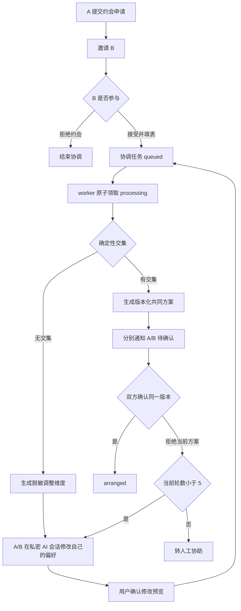

# 双边 AI 约会协调闭环设计

## 1. 设计目标

在不开放用户私聊、不泄露另一方原始回答、不让模型代替用户同意的前提下，把现有“双方表单 → 同步求交集 → 双确认”升级为可排队、可恢复、可多轮调整、可审计的双边 AI 协调流程，并完成正式版测试能力收口。

## 2. 现有能力与改造边界

继续复用：

- `date_coordination` 状态机；
- `date_coordination_application` 版本化申请；
- `date_coordination_proposal` 共同方案；
- `date_coordination_confirmation` 双确认；
- `date_application_patch` AI 修改预览；
- `agent_session` / `agent_message` 私密会话；
- `agent_notification_job` 脱敏通知；
- `report-worker` 每分钟调用 `processWorkerTasks`。

不引入 CloudBase Agent SDK/AG-UI。当前项目已经有云函数 Agent handler 和 LangGraph 可选桥接，同时引入第二套协议会增加会话、权限和部署复杂度。

## 3. 总体流程



## 4. 状态与版本模型

### 4.1 业务状态

保留已有业务状态：

```text
collecting_initiator
inviting_partner
collecting_preferences
computing_overlap
waiting_confirmations
no_overlap
replanning
arranged
invitation_declined / cancelled / expired / manual_handoff
```

### 4.2 处理状态

在 `date_coordination` 增加可选字段：

```text
round_number: 1..5
processing_status: idle | queued | processing | completed | failed
processing_version: number
processing_token: string
processing_attempts: number
processing_started_at: date|null
processing_completed_at: date|null
processing_error_code: string
last_event_at: date
```

规则：

- 两份当前版本申请齐全后，将业务状态设为 `computing_overlap`，处理状态设为 `queued`，立即返回客户端。
- worker 只能领取 `processing_version === coordination_version` 的任务。
- 完成写入时再次校验版本和 token；旧 worker 结果不得覆盖新版本。
- 第一次共同计算为第 1 轮；确认修改或拒绝当前方案后进入下一轮，最多第 5 轮。
- 取消修改预览、普通聊天和重复请求不增加轮数。

### 4.3 方案确认

- 每个 proposal 和 confirmation 必须携带 `coordination_version`。
- 一方修改或拒绝当前方案时，旧 proposal 标记 `superseded`，旧 confirmation 不再有效。
- 只有两个参与者都确认同一个 active proposal 且版本等于协调当前版本时，才能原子写入 `arranged`。

## 5. Worker 与幂等

在现有 `processWorkerTasks` 中加入协调处理：

1. 按 `status=computing_overlap + processing_status=queued` 查询有限批次；
2. 原子领取并写入 lease token；
3. 读取同版本双方申请；
4. 使用确定性 `computeOverlap` 生成候选或缺失维度；
5. 可选调用现有模型生成安全表达，但模型不得改变交集、轮数、接受/拒绝或候选字段；
6. 写入 proposal/事件/通知任务；
7. CAS 完成当前版本；失败按错误类别重试，超过上限进入 `failed`，由用户重试或转人工。

幂等键：

```text
coordination:{coordination_id}:version:{coordination_version}
```

建议新增复合索引（实施前 MCP dry-run）：

```text
collection: date_coordinations
index: coordination_processing_queue
keys: status ASC, processing_status ASC, update_time ASC
unique: false
```

## 6. 双边 AI 会话

### 6.1 隔离

- A、B 各自拥有独立 `date_coordinator` session。
- Prompt 只能包含当前用户自己的申请、共同状态、方案和有限枚举的缺失维度。
- 不向模型或另一方传递手机号、OpenID、精确地址、单位、联系方式或另一方原始文字。

### 6.2 主动反馈

协调事件通过 `agent_notification_job` 投递到双方各自会话：

```text
application_received
partner_joined
coordination_queued
proposal_generated
proposal_rejected
preferences_updated
no_overlap
arranged
manual_handoff
```

每条消息只说明共同进度、当前轮次、方案版本和可调整维度。模型只可润色已经确定的安全摘要。

### 6.3 用户修改

自然语言修改继续使用现有 `date_application_patch`：

```text
用户表达修改
→ AI 生成白名单字段预览
→ 用户确认
→ 保存自己的新版本
→ 旧方案失效
→ 协调任务 queued
```

## 7. 客户端设计

### 7.1 约会协调页

- 延续 Editorial / magazine 风格和现有品牌色。
- 首卡显示：第 N/5 轮、方案版本、待处理/处理中/待确认/已完成/失败。
- 展示三段轨迹：双方信息收集、AI 协调处理、双方确认。
- 失败状态提供重试；达到 5 轮显示人工客服入口。
- 不展示另一方原始表单或修改内容。

### 7.2 AI/客服聊天页

顶部增加紧凑身份条：

```text
我的用户ID  WF-000020    [复制]
提供此编号可帮助客服快速查询
```

- 数据来自 `/api/user/profile` 的 `support_code`。
- 加载失败显示“用户ID加载失败，点击重试”。
- 不显示内部数值 ID、OpenID 或手机号。

### 7.3 正式版清理

- 删除首页“10 秒测试匹配”区块、倒计时、恢复/执行客户端逻辑和相关本地存储。
- 删除正式客户端对 `MATCH_TEST_RUNS` 的引用。
- 不删除服务端受控测试接口和 selfcheck；正式环境关闭公开测试 flag。
- faker 历史匹配详情只显示不可继续约会状态，不再提供正式约会入口。

## 8. 用户编号

- 沿用 `support_code = WF-xxxxxx`，不改变数据库内部 `id`。
- 新注册成功返回前必须完成 `ensureUserSupportCode`；失败则返回明确错误，不返回缺编号的成功响应。
- 现有编号保持不变；并发唯一性继续由 `system_counters/user_support_code` 事务保证。
- 后台搜索和客服聚合继续以 `support_code` 为公开查询键。

## 9. faker 隐藏策略

- 正式候选池继续以 `canEnterFormalCandidatePool` 作为唯一入口，任何 synthetic/test 标记都失败关闭。
- 手动/测试匹配不得被正式客户端调用。
- CloudBase 发布前只读列出 synthetic 记录并验证 `profile_origin`、`is_test_fixture`、`status` 和既有正式 claim。
- 标记缺失时先输出 dry-run；修复只补身份/可见性字段，不删除记录、不改真人资料。
- 后台默认 `include_test=false`，测试数据仅在管理员主动选择时出现。

## 10. API 变化

现有详情响应增加：

```json
{
  "round_number": 2,
  "max_rounds": 5,
  "processing_status": "queued",
  "processing_version": 3,
  "processing_error_code": "",
  "last_event_at": "ISO date"
}
```

新增或扩展内部 worker action，不新增公开匿名 API。所有协调读写继续校验微信当前用户是参与者。

## 11. 测试策略

自动测试：

- 需求 R6 的 8 个固定场景；
- worker 并发领取、lease 过期、旧版本完成、重试幂等；
- 第 5 轮后转人工；
- 明确拒绝立即停止；
- A/B 会话不泄露另一方原始字段；
- 正式客户端无测试按钮/API 引用；
- synthetic 不能进入正式候选池；
- support_code 并发唯一、不可变，聊天页展示和复制。

真机测试：

- 两个独立微信账号完成一轮成功；
- 时间冲突，经 AI 修改后成功；
- 一方拒绝当前方案后进入下一轮；
- 一方明确拒绝约会后停止。

## 12. 部署与回滚

顺序：

1. 本地批次实现和六组门禁；
2. CloudBase MCP 只读核对 faker 与 flags；
3. MCP 创建/核对索引；
4. 部署 `api`，验证 ping、路由和 worker；
5. 上传体验版，完成双账号真机验收；
6. 用户单独确认后提交正式审核。

回滚：保留部署前函数代码；新字段均为向后兼容可选字段；客户端回退不删除协调、用户编号或审计数据。
